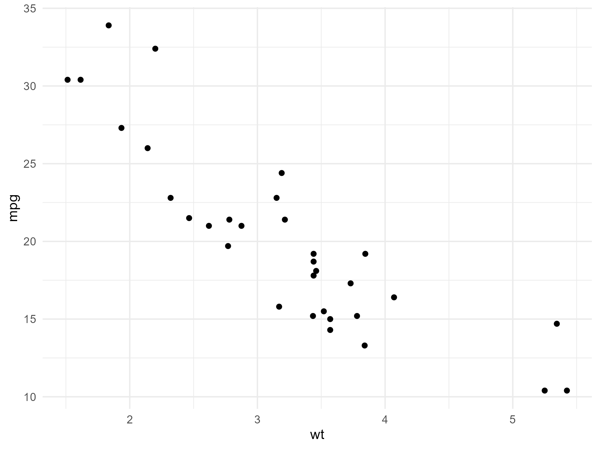

<!-- README.md is generated from README.Rmd. Please edit that file -->

# sameplot

<!-- badges: start -->

[](https://github.com/TomNaber/sameplot/actions/workflows/R-CMD-check.yaml)
<!-- badges: end -->

Render plots consistently across interactive R Markdown sessions, saved
files, and knitr output by drawing to a `ragg` device and displaying the
resulting image via `knitr::include_graphics()`.

## Why?

RStudio’s R Markdown inline plots, saved figures, and knitted documents
can differ due to different rendering engines and sizing settings.
`sameplot()` standardizes output by always rendering the plot to an
image first and then displaying *that* image in the correct size.

## Installation

You can install the development version from GitHub:

``` r
install.packages("pak")
pak::pak("TomNaber/sameplot")
```

Alternatively (remotes):

``` r
install.packages("remotes")
remotes::install_github("TomNaber/sameplot")
```

## Usage

``` r
library(sameplot)

p <- ggplot2::ggplot(mtcars, ggplot2::aes(wt, mpg)) +
  ggplot2::geom_point() +
  ggplot2::theme_minimal()

# 1) Display a temporary PNG
sameplot(p)

# 2) Save a PNG
sameplot(p, file = file.path("figures", "mtcars.png"), save = TRUE)

# 3) Save a TIFF (still displays via a temp PNG for compatibility)
sameplot(p, file = file.path("figures", "mtcars.tiff"), save = TRUE)
```



## Notes

- Supported output extensions for saving: `.png`, `.tif`, `.tiff`.

- When `save = FALSE`, figures are written to a temporary location and
  cleaned up when the R session ends.

- `dpi` in the knitr output is set to the same value as `res` used for
  the `ragg` device.

- **When knitting to HTML with `rmarkdown::html_document`, set
  `self_contained: true`** in the YAML. This ensures the images produced
  by `sameplot()` are embedded in the HTML rather than linked as
  external files in a temporary folder that is not accessible to the
  HTML when knitting is complete. Example:

  ``` yaml
  output:
    html_document:
      self_contained: true
  ```

### `sameplot()` requires inline output (not “Chunk Output in Console”)

`sameplot()` is designed for use in `.Rmd` documents and works by
rendering to an image file (a temporary PNG) and then displaying that
file via `knitr::include_graphics()`.

Because this returns a document output, not an interactive plot object,
it does not work with Rstudio’s **Chunk Output in Console** mode.

To use `sameplot()` in RStudio, enable **inline output**: - Click the
settings **cogwheel** next to the **Knit** button - Make sure **Chunk
Output Inline** (not “Chunk Output in Console”) is enabled.

### Optional: Matching `sameplot()` output without using `sameplot()`

Sometimes you can’t pass a plot object to `sameplot()`, e.g., when a
function draws immediately and returns `NULL`. In that case you can
still get device-consistent results with the settings below. Note that
the solution below requires `ragg` to be installed with
`install.packages("ragg")`.

**1) Use `ragg` for knitr rendering and set chunk options**

Set chunk defaults either globally (setup chunk) or
per-figure-containing chunk:

- `dev = "ragg_png"` so knitr renders using a `ragg` device
- `fig.retina = 1` to avoid implicit upscaling
- `out.width = "100%"` and `out.height = "100%"` so the sameplot() image
  fills the same output box as regular chunk figures.
- Explicit `fig.width`, `fig.height`, and `dpi` (these example matches
  `sameplot()` defaults)

Example (setup chunk):

``` r
knitr::opts_chunk$set(
  dev = "ragg_png",
  fig.retina = 1,
  out.width = "100%",
  out.height = "100%",
  fig.width  = 6.4,
  fig.height = 4.8,
  dpi = 300
)
```

**2) Set AGG backend in RStudio for inline output**

In RStudio, set: `Tools` → `Global Options...` → `General` → `Graphics`
→ `Backend` → `AGG`
